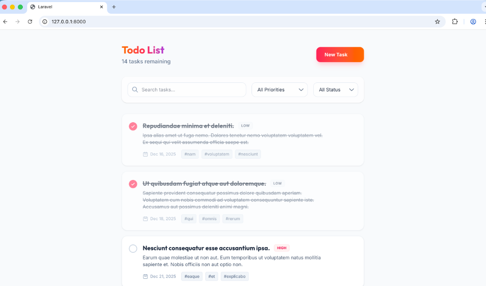
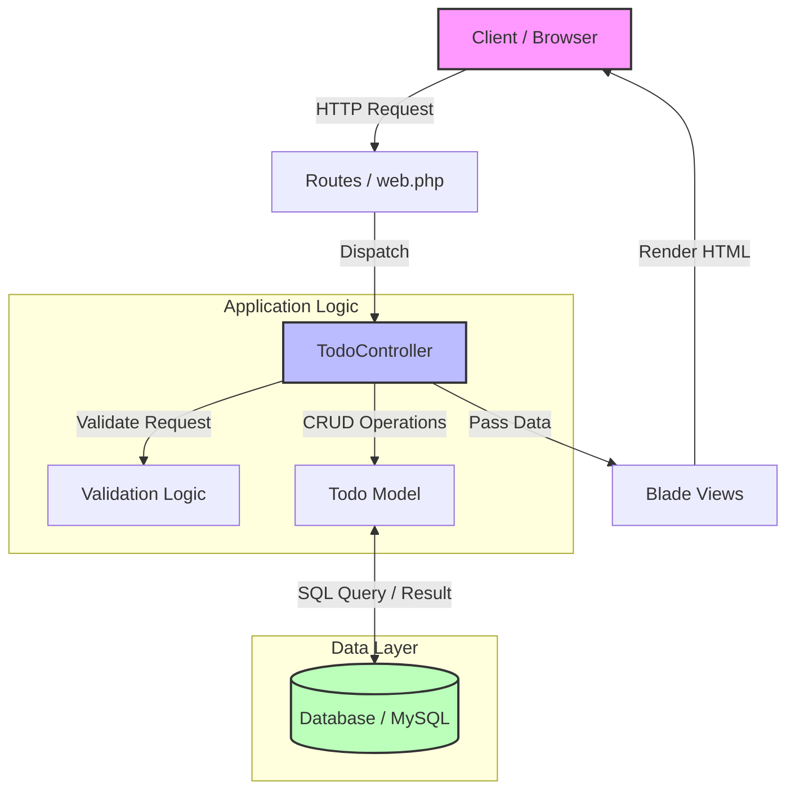

# ✨ Laravel Modern Todo App

A beautiful, robust, and user-friendly Task Management application built with **Laravel**. This isn't just another boring CRUD app; it's designed with a premium user interface, smooth interactions, and a codebase that's easy for beginners to understand and extend.




---

## 🚀 Features

We wanted to build something that feels great to use. Here is what creates that experience:

*   **Smart Task Management**: Create tasks with titles, descriptions, due dates, and tags.
*   **Prioritization**: Flag tasks as **High**, **Medium**, or **Low** priority so you know what to tackle first.
*   **Search & Filtering**: instantly find tasks using the search bar, or filter by Priority and Status (ToDo/Done).
*   **Modern UI/UX**: Built with **Tailwind CSS**. Features glassmorphism effects, smooth gradients, and mobile responsiveness.
*   **Interactive Feedback**: Visual cues for completed tasks, graceful empty states, and modal confirmations for critical actions (like deleting items).

---

## 🛠 System Design & Architecture

If you are new to Laravel, here is how we structured the application so you can navigate it easily. We follow the standard **MVC (Model-View-Controller)** pattern.

### 📂 directory Structure

```text
laravel-crud-todos/
├── app/
│   ├── Http/Controllers/
│   │   └── TodoController.php   <-- The "Brain". Handles all logic (saving, deleting, filtering).
│   └── Models/
│       └── Todo.php             <-- The "Blueprint". Defines what a 'Todo' task looks like in the database.
├── resources/
│   └── views/
│       ├── layouts/
│       │   └── app.blade.php    <-- The "Skeleton". Main shell containing headers, fonts, and scripts.
│       └── todos/
│           ├── index.blade.php  <-- The "Homepage". Lists all your tasks.
│           ├── create.blade.php <-- The "Form". Page to add new tasks.
│           └── edit.blade.php   <-- The "Editor". Page to update existing tasks.
└── routes/
    └── web.php                  <-- The "Map". Defines URL paths (like /todos/create).
```


### 🏗 System Design Architecture

Here is a high-level overview of how the requests flow through the system:



### 🧠 How It Works (The Flow)

1.  **The Route**: When you visit the site, `web.php` directs traffic to the...
2.  **Controller**: `TodoController.php` asks the database for your tasks using the `Todo` model.
3.  **The View**: The controller sends that data to `index.blade.php`, which renders the HTML you see in the browser.

---

## ⚡️ Getting Started

Follow these steps to get this running on your local machine.

**1. Clone the Repository**
```bash
git clone https://github.com/yusufdupsc1/laravel-crud-todos.git
cd laravel-crud-todos
```

**2. Install Dependencies**
We need both PHP libraries (for Laravel) and JavaScript libraries (for styling).
```bash
composer install
npm install
```

**3. Environment Setup**
Duplicate the example environment file and generate your unique app key.
```bash
cp .env.example .env
php artisan key:generate
```
*Tip: Make sure you create a database (e.g., in MySQL or use SQLite) and update the `DB_DATABASE` section in your new `.env` file.*

**4. Database Migration**
Create the necessary tables in your database.
```bash
php artisan migrate
```

**5. Launch! 🚀**
You'll need two terminals open to run this properly.

Terminal 1 (PHP Server):
```bash
php artisan serve
```

Terminal 2 (Asset Compiler - for the pretty CSS):
```bash
npm run dev
```

Visit `http://127.0.0.1:8000` in your browser and start getting organized!

---

## 🤝 Credits & Connect

This project was built with ❤️ and coffee. If you found this helpful or want to see more of our work, come say hi!

**👨‍💻 Development Team**

| Contributor | Role | GitHub |
| :--- | :--- | :--- |
| **Omar Faruk** | Lead Developer | [@OmarFaruk](https://github.com/omarbg) |
| **Yusuf** | Project Creator | [@yusufdupsc1](https://github.com/yusufdupsc1) |

Feel free to fork this project, submit PRs, or star the repo if it helped you learn something new today. Happy coding!
